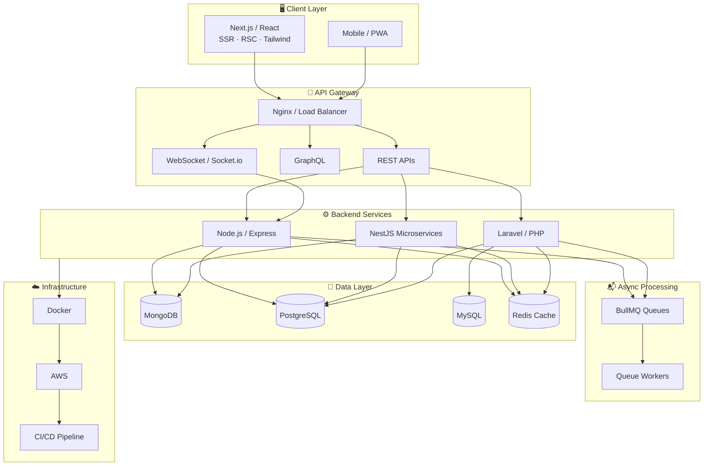

<!-- ═══════════════════════════════════════════════════════════════
     HEADER BANNER
     ═══════════════════════════════════════════════════════════════ -->


<div align="center">

<!-- Profile Views + Status -->


<br/><br/>

<!-- Animated Typing -->


<br/>

<!-- Social Links — open in new tab -->
<a href="https://azadrajsingh.dekhohukum.com/" target="_blank" rel="noopener noreferrer">
  
</a>
<a href="https://linkedin.com/in/azadsinghgahlot" target="_blank" rel="noopener noreferrer">
  
</a>
<a href="https://github.com/azadrajsingh" target="_blank" rel="noopener noreferrer">
  
</a>
<br/>
<a href="mailto:azadsingh9994@gmail.com" target="_blank" rel="noopener noreferrer">
  
</a>
<a href="https://wa.me/918740899848" target="_blank" rel="noopener noreferrer">
  
</a>
<br/>
<a href="https://zerotrace-one.vercel.app/" target="_blank" rel="noopener noreferrer">
  
</a>
<a href="https://dekhohukum.com/" target="_blank" rel="noopener noreferrer">
  
</a>
<a href="https://blogs.dekhohukum.com/" target="_blank" rel="noopener noreferrer">
  
</a>
<a href="https://www.maxpay.vip/" target="_blank" rel="noopener noreferrer">
  
</a>

</div>

<!-- Divider -->


<!-- ═══════════════════════════════════════════════════════════════
     ABOUT — Two Column Layout
     ═══════════════════════════════════════════════════════════════ -->

##  About Me

<table>
<tr>
<td width="55%" valign="top">

```typescript
const azad = {
  role: "Full-Stack / Backend Developer",
  location: "Jaipur, India 🇮🇳",
  experience: "5+ years",
  focus: ["Backend Architecture", "Real-Time Systems", "Fintech", "WebRTC"],
  stacks: ["MERN", "Next.js", "NestJS", "Laravel"],
  currentlyAt: "Nimble AppGenie",
  openTo: ["Full-Time", "Contract", "Remote"],
  funFact: "Built MaxPay & DafriPremier — 500K+ txns/day"
};
```

Backend-first engineer shipping **production-grade systems** at scale — from real-time MERN platforms with **100K+ DAU** to Laravel fintech processing **500K+ daily transactions**.

Expert in RESTful APIs, microservices, Redis caching, BullMQ queues, Socket.io, and database optimization. Deployed on **AWS** with Docker & CI/CD.

🌐 <a href="https://azadrajsingh.dekhohukum.com/" target="_blank" rel="noopener noreferrer"><b>Explore My Portfolio →</b></a>

</td>
<td width="45%" valign="top">

### 🔥 Currently Working On

- **ZeroTrace** — private encrypted P2P video, voice & chat (WebRTC)
- MaxPay VIP & Global payment gateway systems
- Real-time messaging & matchmaking platforms
- Next.js SSR apps with 95+ PageSpeed scores

### 🎯 What I Bring

| | |
|:---:|:---|
| ⚡ | Sub-second latency at 100K+ scale |
| 🏦 | Fintech — wallets, gateways, fraud detection |
| 🔄 | Real-time — Socket.io, BullMQ, Redis |
| ☁️ | AWS · Docker · CI/CD · 99.9% uptime |

</td>
</tr>
</table>

<!-- ═══════════════════════════════════════════════════════════════
     IMPACT METRICS
     ═══════════════════════════════════════════════════════════════ -->

## 📊 Production Impact

<div align="center">

| 💳 | 👥 | 🟢 | 💼 |
|:---:|:---:|:---:|:---:|
| **`500K+`** | **`100K+`** | **`99.9%`** | **`5+`** |
| Daily Transactions | Daily Active Users | System Uptime | Years Experience |

</div>

<!-- ═══════════════════════════════════════════════════════════════
     ARCHITECTURE
     ═══════════════════════════════════════════════════════════════ -->

## 🏗️ System Architecture I Build



<!-- ═══════════════════════════════════════════════════════════════
     TECH STACK
     ═══════════════════════════════════════════════════════════════ -->

## 🛠️ Tech Stack & Proficiency

<div align="center">


</div>

<br/>

<table>
<tr>
<td width="50%" valign="top">

**Core Stacks**

```
MERN Stack     ████████████████████  95%
Next.js        ██████████████████░░  90%
NestJS         █████████████████░░░  88%
Laravel        ██████████████████░░  92%
Node.js        ███████████████████░  94%
TypeScript     █████████████████░░░  90%
```

</td>
<td width="50%" valign="top">

**Infrastructure & Tools**

```
Docker / AWS   █████████████████░░░  88%
Redis / Cache  ███████████████████░  93%
Socket.io      ████████████████████  95%
PostgreSQL     █████████████████░░░  87%
MongoDB        ███████████████████░  92%
CI/CD          █████████████████░░░  85%
```

</td>
</tr>
</table>

<details>
<summary><b>📦 Full Technology Breakdown</b></summary>
<br/>

| Category | Technologies |
|:---------|:-------------|
| **Frontend** | React.js, Next.js, Tailwind CSS, SSR, RSC, API Routes |
| **Backend** | Node.js, Express, NestJS, Laravel, PHP, REST, GraphQL |
| **Real-Time** | Socket.io, WebRTC, BullMQ, Redis Pub/Sub, Firebase Auth |
| **Databases** | MongoDB, PostgreSQL, MySQL, Redis, Eloquent ORM |
| **Fintech** | MaxPay VIP, MaxPay Global, DafriPremier, Wallets, Stripe, Sanctum |
| **Security** | End-to-End Encryption, JWT, Sanctum, Peer-to-Peer Architecture |
| **DevOps** | Docker, AWS, CI/CD, Nginx, PHPUnit, JWT |
| **Integrations** | Twilio, Firebase, Azure TTS, Apple IAP, WebRTC |

</details>

<!-- ═══════════════════════════════════════════════════════════════
     EXPERIENCE
     ═══════════════════════════════════════════════════════════════ -->

## 💼 Career Journey

```
  2022          2023          2024          2025          2026
   │             │             │             │             │
   ├─────────────┼─────────────┼─────────────┼─────────────┤
   │  Eplanet Soft (Laravel Backend)           │             │
   │             │  Deorwine Infotech (Full-Stack)         │
   │             │             │  Nimble AppGenie ◄── YOU ARE HERE
   └─────────────┴─────────────┴─────────────┴─────────────┘
```

<details open>
<summary><b>🏢 Nimble AppGenie — Full-Stack / Backend Developer</b> · <code>Jun 2024 – Present</code> · 🟢 Current</summary>
<br/>

| # | Achievement | Impact |
|:-:|:------------|:------:|
| 01 | Horse League fantasy racing platform (MERN + Socket.io) | **100K+ DAU** |
| 02 | Real-time messaging — WhatsApp-like chat, A/V calling | Production |
| 03 | Matchmaking platform with optimized MongoDB schemas | **100K+ users** |
| 04 | MaxPay VIP & Global — cross-border payment platforms (Laravel) | **500K+ txns/day** |
| 05 | DafriPremier FinTech — crypto on/off-ramp, MobiCash, escrow | **99.9% uptime** |

`MERN` · `Next.js` · `Node.js` · `Laravel` · `Socket.io` · `Redis` · `BullMQ`

</details>

<details>
<summary><b>🏢 Deorwine Infotech — Full-Stack / Backend Developer</b> · <code>Apr 2023 – Jun 2024</code></summary>
<br/>

Full-stack MERN & Next.js applications — REST APIs, React frontends, MongoDB schemas, and production deployments.

`MERN` · `Next.js` · `React` · `Node.js` · `MongoDB`

</details>

<details>
<summary><b>🏢 Eplanet Soft — Backend Developer (Laravel)</b> · <code>Feb 2022 – Apr 2023</code></summary>
<br/>

Laravel backends, payment systems, queue workers, Eloquent ORM, and RESTful API development.

`Laravel` · `MySQL` · `Redis` · `REST APIs` · `PHPUnit`

</details>

> 🎓 **B.Tech** — Rajasthan Institute of Engineering & Technology, Jaipur *(2012 – 2016)*

<!-- ═══════════════════════════════════════════════════════════════
     PROJECTS
     ═══════════════════════════════════════════════════════════════ -->

## 🚀 Featured Projects

<details open>
<summary><b>🌟 Personal Projects — Built by Me</b></summary>
<br/>

<table>
<tr><th width="40"></th><th>Project</th><th>Description</th><th>Tech</th></tr>
<tr>
<td align="center">🔒</td>
<td><a href="https://zerotrace-one.vercel.app/" target="_blank" rel="noopener noreferrer"><b>ZeroTrace ↗</b></a></td>
<td>Private encrypted video, voice & chat — P2P, no accounts, rooms vanish in 1 hour</td>
<td><code>Next.js</code> <code>WebRTC</code> <code>Socket.io</code> <code>E2E</code></td>
</tr>
<tr>
<td align="center">🛍️</td>
<td><a href="https://dekhohukum.com/" target="_blank" rel="noopener noreferrer"><b>Dekho Hukum ↗</b></a></td>
<td>E-commerce for authentic Rajasthani poshak & Rajput attire — cart, checkout, order tracking</td>
<td><code>Next.js</code> <code>Node.js</code> <code>MongoDB</code> <code>Tailwind</code></td>
</tr>
<tr>
<td align="center">📖</td>
<td><a href="https://blogs.dekhohukum.com/" target="_blank" rel="noopener noreferrer"><b>Dekho Hukum Blog ↗</b></a></td>
<td>Rajput history & heritage blog — curated articles on Rajasthani culture & royal legacy</td>
<td><code>Next.js</code> <code>React</code> <code>Node.js</code> <code>MongoDB</code></td>
</tr>
<tr>
<td align="center">🏢</td>
<td><a href="https://azadrajsingh.dekhohukum.com/#projects" target="_blank" rel="noopener noreferrer"><b>Co-Working Booking System ↗</b></a></td>
<td>Real-time desk & room booking — slot management, admin dashboard, auto confirmations</td>
<td><code>Node.js</code> <code>Express</code> <code>Socket.io</code> <code>JWT</code></td>
</tr>
<tr>
<td align="center">🎙️</td>
<td><a href="https://azadrajsingh.dekhohukum.com/#projects" target="_blank" rel="noopener noreferrer"><b>Voice Forge ↗</b></a></td>
<td>Multi-voice TTS generator powered by Azure Edge TTS — language support & audio export</td>
<td><code>Next.js</code> <code>TypeScript</code> <code>Azure</code> <code>REST</code></td>
</tr>
</table>

</details>

<details open>
<summary><b>🏭 Production Systems — Client & Company Work</b></summary>
<br/>

<table>
<tr><th width="40"></th><th>Project</th><th>Description</th><th>Tech</th></tr>
<tr>
<td align="center">💳</td>
<td><a href="https://www.maxpay.vip/" target="_blank" rel="noopener noreferrer"><b>MaxPay VIP ↗</b></a></td>
<td>Business payment gateway for Pan-Asia — 10+ payment systems, T+0 settlement</td>
<td><code>Laravel</code> <code>Redis</code> <code>PostgreSQL</code> <code>REST</code></td>
</tr>
<tr>
<td align="center">🌍</td>
<td><a href="https://maxpay.bet/" target="_blank" rel="noopener noreferrer"><b>MaxPay Global ↗</b></a></td>
<td>Cross-border payments — 50+ currencies, instant FX, <b>500K+ daily transactions</b></td>
<td><code>Laravel</code> <code>Redis</code> <code>PostgreSQL</code> <code>REST</code></td>
</tr>
<tr>
<td align="center">🏦</td>
<td><a href="https://www.dafripremier.com/" target="_blank" rel="noopener noreferrer"><b>DafriPremier ↗</b></a></td>
<td>FinTech platform — crypto on/off-ramp, MobiCash, invoicing, escrow, <b>99.9% uptime</b></td>
<td><code>Laravel</code> <code>PostgreSQL</code> <code>Redis</code> <code>AWS</code></td>
</tr>
<tr>
<td align="center">🎵</td>
<td><a href="https://azadrajsingh.dekhohukum.com/#projects" target="_blank" rel="noopener noreferrer"><b>The Flow ↗</b></a></td>
<td>Apple Music–style streaming — Stripe & Apple IAP subscriptions, secure content delivery</td>
<td><code>Laravel</code> <code>Stripe</code> <code>Apple IAP</code> <code>AWS</code></td>
</tr>
<tr>
<td align="center">🏇</td>
<td><a href="https://azadrajsingh.dekhohukum.com/#projects" target="_blank" rel="noopener noreferrer"><b>Horse League ↗</b></a></td>
<td>Fantasy racing — live tracking, leaderboards, BullMQ jobs, <b>100K+ DAU</b></td>
<td><code>MERN</code> <code>Socket.io</code> <code>Redis</code> <code>BullMQ</code></td>
</tr>
<tr>
<td align="center">💬</td>
<td><a href="https://azadrajsingh.dekhohukum.com/#projects" target="_blank" rel="noopener noreferrer"><b>Real-Time Messaging ↗</b></a></td>
<td>WhatsApp-like chat — direct/group messaging, audio/video calling, Firebase Auth</td>
<td><code>Next.js</code> <code>Socket.io</code> <code>Firebase</code> <code>Twilio</code></td>
</tr>
<tr>
<td align="center">💕</td>
<td><a href="https://azadrajsingh.dekhohukum.com/#projects" target="_blank" rel="noopener noreferrer"><b>Matchmaking Platform ↗</b></a></td>
<td>Real-time chat & matchmaking for <b>100K+ users</b> — sub-second message delivery</td>
<td><code>MERN</code> <code>Socket.io</code> <code>MongoDB</code> <code>Redis</code></td>
</tr>
</table>

</details>

<!-- ═══════════════════════════════════════════════════════════════
     GITHUB ANALYTICS
     ═══════════════════════════════════════════════════════════════ -->

## 📈 GitHub Analytics

<div align="center">

<!-- HTML img tags = not clickable on GitHub (no second-screen popup) -->


<br/>


<br/><br/>


<br/><br/>


</div>

<!-- ═══════════════════════════════════════════════════════════════
     CONNECT
     ═══════════════════════════════════════════════════════════════ -->


<div align="center">

**Open to full-time, contract & remote opportunities**

MERN · Next.js · NestJS · Laravel — I respond within 24 hours.

<br/>

<a href="https://azadrajsingh.dekhohukum.com/" target="_blank" rel="noopener noreferrer">
  
</a>
<a href="https://wa.me/918740899848" target="_blank" rel="noopener noreferrer">
  
</a>
<a href="mailto:azadsingh9994@gmail.com" target="_blank" rel="noopener noreferrer">
  
</a>
<br/>
<a href="https://linkedin.com/in/azadsinghgahlot" target="_blank" rel="noopener noreferrer">
  
</a>
<a href="https://github.com/azadrajsingh" target="_blank" rel="noopener noreferrer">
  
</a>
<br/>
<a href="https://zerotrace-one.vercel.app/" target="_blank" rel="noopener noreferrer">
  
</a>
<a href="https://www.maxpay.vip/" target="_blank" rel="noopener noreferrer">
  
</a>
<a href="https://maxpay.bet/" target="_blank" rel="noopener noreferrer">
  
</a>
<a href="https://www.dafripremier.com/" target="_blank" rel="noopener noreferrer">
  
</a>
<br/>
<a href="https://dekhohukum.com/" target="_blank" rel="noopener noreferrer">
  
</a>
<a href="https://blogs.dekhohukum.com/" target="_blank" rel="noopener noreferrer">
  
</a>

<br/><br/>

💻 · 🖥️ · ☁️ · 🗄️ · 🚀

<br/><br/>

**AzadRaj Singh Gahlot**

*Full-Stack / Backend Developer · Jaipur, India · 5+ Years*

⭐️ From <a href="https://github.com/azadrajsingh" target="_blank" rel="noopener noreferrer"><b>azadrajsingh</b></a>

<br/>


</div>
