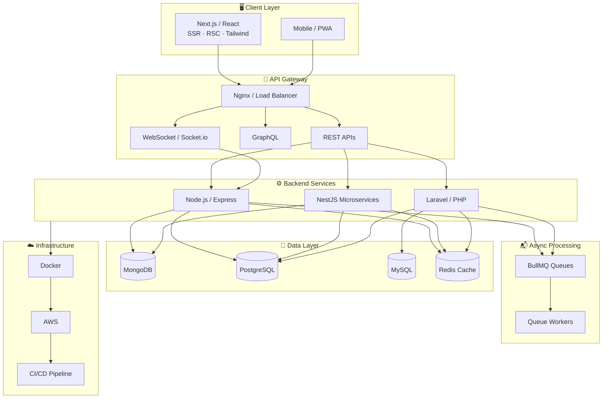

<!-- ═══════════════════════════════════════════════════════════════
     HEADER BANNER
     ═══════════════════════════════════════════════════════════════ -->


<div align="center">

<!-- Profile Views + Status -->


<br/><br/>

<!-- Animated Typing -->


<br/>

<!-- Social Links -->
[](https://azadrajsingh.dekhohukum.com/)
[](https://linkedin.com/in/azadsinghgahlot)
[](https://github.com/azadrajsingh)
[](mailto:azadsingh9994@gmail.com)
[](https://wa.me/918740899848)

</div>

<!-- Divider -->


<!-- ═══════════════════════════════════════════════════════════════
     ABOUT — Two Column Layout
     ═══════════════════════════════════════════════════════════════ -->

##  About Me

<table>
<tr>
<td width="55%" valign="top">

```typescript
const azad = {
  role: "Full-Stack / Backend Developer",
  location: "Jaipur, India 🇮🇳",
  experience: "5+ years",
  focus: ["Backend Architecture", "Real-Time Systems", "Fintech"],
  stacks: ["MERN", "Next.js", "NestJS", "Laravel"],
  currentlyAt: "Nimble AppGenie",
  openTo: ["Full-Time", "Contract", "Remote"],
  funFact: "Built systems processing 500K+ txns/day"
};
```

Backend-first engineer shipping **production-grade systems** at scale — from real-time MERN platforms with **100K+ DAU** to Laravel fintech processing **500K+ daily transactions**.

Expert in RESTful APIs, microservices, Redis caching, BullMQ queues, Socket.io, and database optimization. Deployed on **AWS** with Docker & CI/CD.

🌐 **[Explore My Portfolio →](https://azadrajsingh.dekhohukum.com/)**

</td>
<td width="45%" valign="top">

### 🔥 Currently Working On

- Real-time messaging & matchmaking platforms
- Laravel fintech & payment gateway systems
- Next.js SSR apps with 95+ PageSpeed scores
- NestJS microservices & modular API architecture

### 🎯 What I Bring

| | |
|:---:|:---|
| ⚡ | Sub-second latency at 100K+ scale |
| 🏦 | Fintech — wallets, gateways, fraud detection |
| 🔄 | Real-time — Socket.io, BullMQ, Redis |
| ☁️ | AWS · Docker · CI/CD · 99.9% uptime |

</td>
</tr>
</table>

<!-- ═══════════════════════════════════════════════════════════════
     IMPACT METRICS
     ═══════════════════════════════════════════════════════════════ -->


<div align="center">

| | | | |
|:---:|:---:|:---:|:---:|
| <br/><br/>**`500K+`**<br/><sub>Daily Transactions</sub> | <br/><br/>**`100K+`**<br/><sub>Daily Active Users</sub> | <br/><br/>**`99.9%`**<br/><sub>System Uptime</sub> | <br/><br/>**`5+`**<br/><sub>Years Experience</sub> |

</div>

<!-- ═══════════════════════════════════════════════════════════════
     ARCHITECTURE
     ═══════════════════════════════════════════════════════════════ -->




<!-- ═══════════════════════════════════════════════════════════════
     TECH STACK
     ═══════════════════════════════════════════════════════════════ -->


<div align="center">


</div>

<br/>

<table>
<tr>
<td width="50%" valign="top">

**Core Stacks**

```
MERN Stack     ████████████████████  95%
Next.js        ██████████████████░░  90%
NestJS         █████████████████░░░  88%
Laravel        ██████████████████░░  92%
Node.js        ███████████████████░  94%
TypeScript     █████████████████░░░  90%
```

</td>
<td width="50%" valign="top">

**Infrastructure & Tools**

```
Docker / AWS   █████████████████░░░  88%
Redis / Cache  ███████████████████░  93%
Socket.io      ████████████████████  95%
PostgreSQL     █████████████████░░░  87%
MongoDB        ███████████████████░  92%
CI/CD          █████████████████░░░  85%
```

</td>
</tr>
</table>

<details>
<summary><b>📦 Full Technology Breakdown</b></summary>
<br/>

| Category | Technologies |
|:---------|:-------------|
| **Frontend** | React.js, Next.js, Tailwind CSS, SSR, RSC, API Routes |
| **Backend** | Node.js, Express, NestJS, Laravel, PHP, REST, GraphQL |
| **Real-Time** | Socket.io, BullMQ, Redis Pub/Sub, Firebase Auth |
| **Databases** | MongoDB, PostgreSQL, MySQL, Redis, Eloquent ORM |
| **Fintech** | Payment Gateways, Multi-currency Wallets, Stripe, Sanctum |
| **DevOps** | Docker, AWS, CI/CD, Nginx, PHPUnit, JWT |
| **Integrations** | Twilio, Firebase, Azure TTS, Apple IAP |

</details>

<!-- ═══════════════════════════════════════════════════════════════
     EXPERIENCE
     ═══════════════════════════════════════════════════════════════ -->


```
  2022          2023          2024          2025          2026
   │             │             │             │             │
   ├─────────────┼─────────────┼─────────────┼─────────────┤
   │  Eplanet Soft (Laravel Backend)           │             │
   │             │  Deorwine Infotech (Full-Stack)         │
   │             │             │  Nimble AppGenie ◄── YOU ARE HERE
   └─────────────┴─────────────┴─────────────┴─────────────┘
```

<details open>
<summary><b>🏢 Nimble AppGenie — Full-Stack / Backend Developer</b> · <code>Jun 2024 – Present</code> · 🟢 Current</summary>
<br/>

| # | Achievement | Impact |
|:-:|:------------|:------:|
| 01 | Horse League fantasy racing platform (MERN + Socket.io) | **100K+ DAU** |
| 02 | Real-time messaging — WhatsApp-like chat, A/V calling | Production |
| 03 | Matchmaking platform with optimized MongoDB schemas | **100K+ users** |
| 04 | MaxPay payment ecosystem (Laravel, 50+ currencies) | **500K+ txns/day** |
| 05 | Dafri Bank backend — Redis caching & PostgreSQL tuning | **99.9% uptime** |

`MERN` · `Next.js` · `Node.js` · `Laravel` · `Socket.io` · `Redis` · `BullMQ`

</details>

<details>
<summary><b>🏢 Deorwine Infotech — Full-Stack / Backend Developer</b> · <code>Apr 2023 – Jun 2024</code></summary>
<br/>

Full-stack MERN & Next.js applications — REST APIs, React frontends, MongoDB schemas, and production deployments.

`MERN` · `Next.js` · `React` · `Node.js` · `MongoDB`

</details>

<details>
<summary><b>🏢 Eplanet Soft — Backend Developer (Laravel)</b> · <code>Feb 2022 – Apr 2023</code></summary>
<br/>

Laravel backends, payment systems, queue workers, Eloquent ORM, and RESTful API development.

`Laravel` · `MySQL` · `Redis` · `REST APIs` · `PHPUnit`

</details>

> 🎓 **B.Tech** — Rajasthan Institute of Engineering & Technology, Jaipur *(2012 – 2016)*

<!-- ═══════════════════════════════════════════════════════════════
     PROJECTS
     ═══════════════════════════════════════════════════════════════ -->


<details open>
<summary><b>🌟 Personal Projects — Built by Me</b></summary>
<br/>

| | Project | Description | Tech |
|:-:|:--------|:------------|:-----|
| 🛍️ | [**Dekho Hukum**](https://dekhohukum.com/) | E-commerce for authentic Rajasthani poshak & Rajput attire | `Next.js` `Node.js` `MongoDB` `Tailwind` |
| 📖 | [**Dekho Hukum Blog**](https://blog.dekhohukum.com/) | Rajput history & heritage blog with SEO optimization | `Next.js` `React` `Node.js` `MongoDB` |
| 🏢 | **Co-Working Booking System** | Real-time desk & room booking with admin dashboard | `Node.js` `Express` `Socket.io` `JWT` |
| 🎙️ | **Voice Forge** | Multi-voice TTS generator powered by Azure Edge TTS | `Next.js` `TypeScript` `Azure` `REST` |

</details>

<details open>
<summary><b>🏭 Production Systems — Client & Company Work</b></summary>
<br/>

| | Project | Description | Tech |
|:-:|:--------|:------------|:-----|
| 🏇 | **Horse League** | Fantasy racing — live tracking, leaderboards, BullMQ jobs | `MERN` `Socket.io` `Redis` `BullMQ` |
| 💬 | **Real-Time Messaging** | WhatsApp-like chat with audio/video calling | `Next.js` `Socket.io` `Firebase` `Twilio` |
| 💳 | **MaxPay Ecosystem** | Multi-currency payment gateway, 50+ currencies | `Laravel` `PostgreSQL` `Redis` |
| 🏦 | **Dafri Bank** | Banking backend with fraud detection | `Laravel` `PostgreSQL` `AWS` |
| 💕 | **Matchmaking Platform** | Real-time chat & matchmaking, sub-second delivery | `MERN` `Socket.io` `MongoDB` |
| 📺 | **The Flow Streaming** | Streaming backend with Stripe & Apple IAP | `Laravel` `Stripe` `AWS` |

</details>

<!-- ═══════════════════════════════════════════════════════════════
     GITHUB ANALYTICS
     ═══════════════════════════════════════════════════════════════ -->


<div align="center">


<br/><br/>


<br/>


<br/><br/>


<br/><br/>


<br/><br/>

<!-- Contribution Snake — auto-generated via GitHub Actions -->


</div>

<!-- ═══════════════════════════════════════════════════════════════
     CONNECT
     ═══════════════════════════════════════════════════════════════ -->


<div align="center">

**Open to full-time, contract & remote opportunities**

MERN · Next.js · NestJS · Laravel — I respond within 24 hours.

<br/>

[](https://azadrajsingh.dekhohukum.com/)
[](https://wa.me/918740899848)
[](mailto:azadsingh9994@gmail.com)
[](https://linkedin.com/in/azadsinghgahlot)
[](https://github.com/azadrajsingh)

<br/><br/>


<br/><br/>

**AzadRaj Singh Gahlot**

*Full-Stack / Backend Developer · Jaipur, India · 5+ Years*

⭐️ From [**azadrajsingh**](https://github.com/azadrajsingh)

<br/>


</div>
